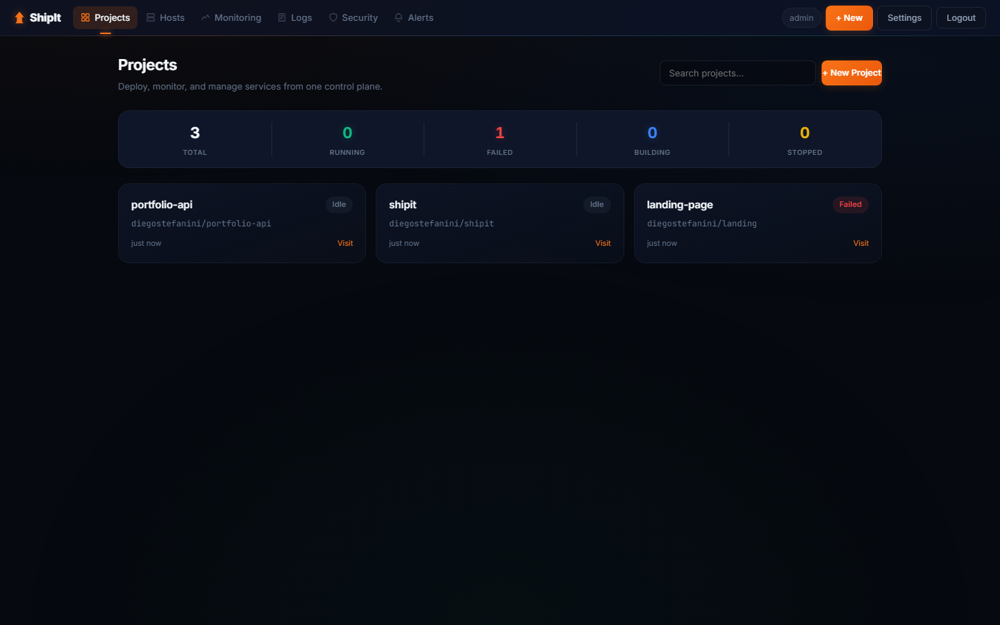
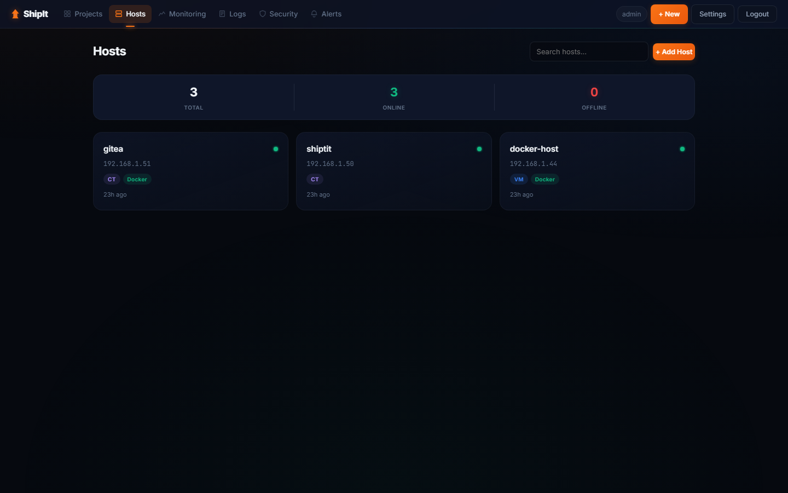
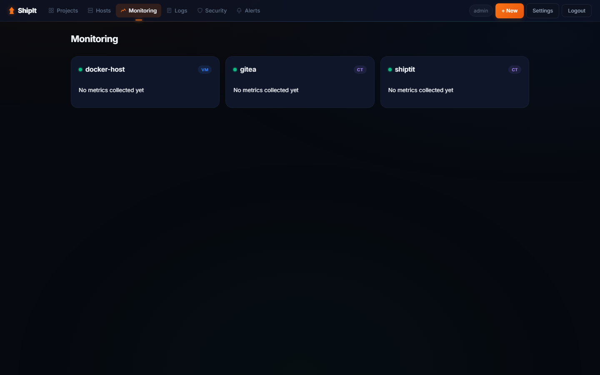
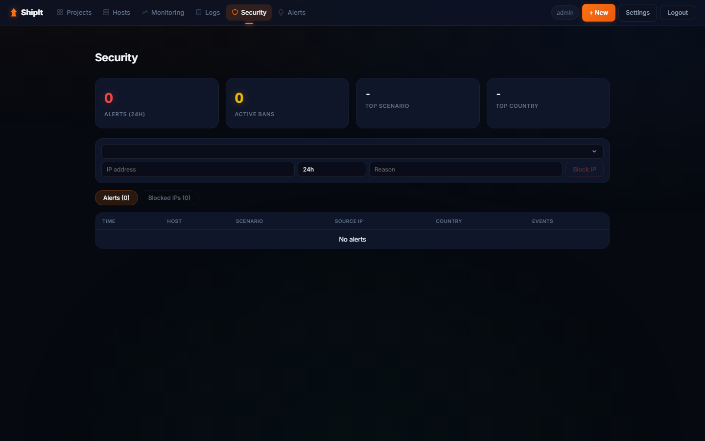
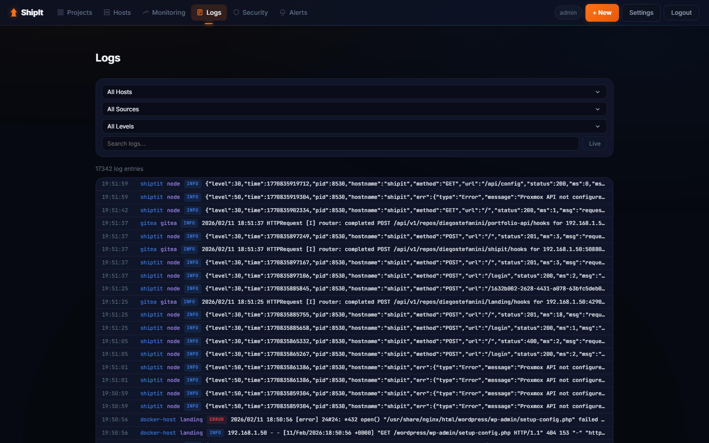
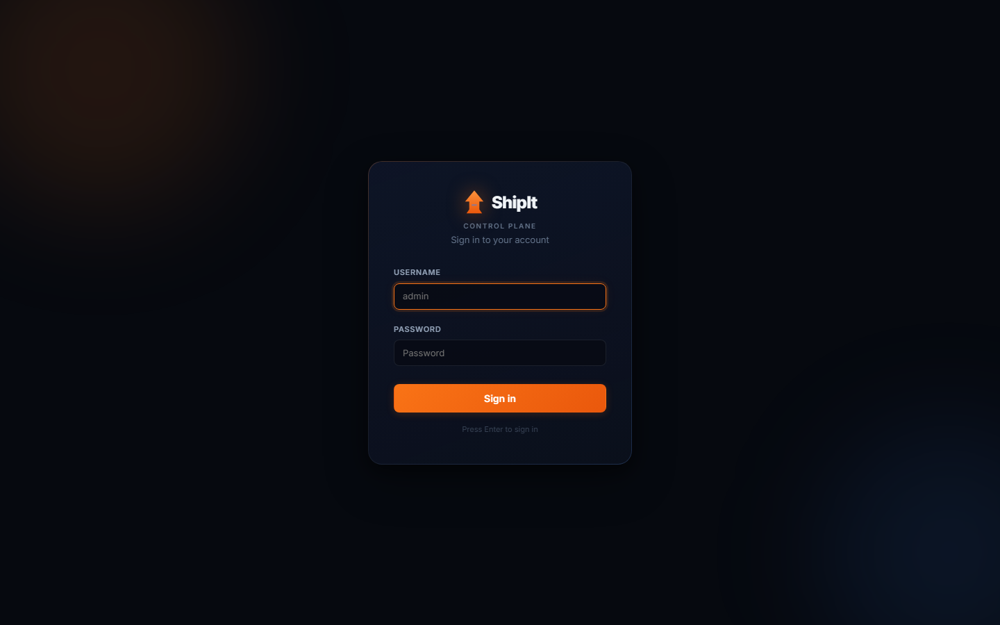

# ShipIt

[](LICENSE)
[](https://www.typescriptlang.org/)
[](https://react.dev/)
[]()

Self-hosted infrastructure management platform for Proxmox homelabs. Deploy, monitor, and secure Docker services from a single control plane.

## Screenshots

<!-- Add your screenshots here. Recommended:
     Save images to docs/screenshots/ and reference them below -->

| Dashboard | Deploy |
|:---------:|:------:|
|  |  |

| Monitoring | Security |
|:----------:|:--------:|
|  |  |

| Logs | Login |
|:----:|:-----:|
|  |  |

## Features

- **Deploy** — Git push to Gitea triggers SSH-based Docker builds on remote hosts
- **Monitoring** — System metrics via Proxmox API + Docker container stats via SSH
- **Logs** — Centralized log viewer (journald, container, HTTP) with live WebSocket streaming
- **Security** — CrowdSec integration with alerts, decisions, manual IP block/unblock
- **Alerts** — Rule-based alerting via Telegram and Discord webhooks
- **Self-deploy** — Auto-updates via Gitea Actions with health check and rollback
- **CLI** — `shipit deploy`, `shipit logs -f` for terminal workflows

## Why ShipIt?

If you run a Proxmox homelab with Docker services, you probably juggle multiple tools: Portainer for containers, SSH for logs, Proxmox GUI for metrics, and manual deploys. ShipIt unifies all of this into one dashboard with zero agents on your hosts — everything works over SSH and the Proxmox API.

## Architecture

```
                    Gitea (CT 201)
                         |
                    webhook push
                         v
    Browser  --->  ShipIt (CT 200)  --->  Docker Host (VM 101)
     React          Express + SQLite        Docker containers
     SPA            bare metal              via SSH
```

- **Frontend**: React 19 + Vite 6 (served by Nginx)
- **Backend**: Express + TypeScript + SQLite (better-sqlite3)
- **Communication**: Proxmox API (metrics) + SSH (deploy, logs, security)
- **No agents** required on managed hosts

## Quick Start

### Prerequisites

- Node.js 20+
- A Proxmox host with SSH access
- Gitea instance (optional, for CI/CD)

### Installation

```bash
# Clone the repo
git clone https://github.com/DiegoStefanini/shipit.git
cd shipit

# Install dependencies
npm install

# Configure environment
cp .env.example .env
# Edit .env with your values (JWT_SECRET, ADMIN_PASSWORD, GITEA_URL, etc.)

# Backend development
cd packages/backend
npm run dev

# Frontend development (separate terminal)
cd packages/frontend
npm run dev
```

### Production Deployment

See [`deploy/`](deploy/) for systemd unit, Nginx config, and install script.

```bash
bash deploy/install.sh
```

## Project Structure

```
packages/
  backend/         Express API server
    src/
      routes/      API endpoints
      services/    SSH, Proxmox, CrowdSec, notifier, collectors
      engine/      Build & deploy engine
      middleware/   Auth, validation, rate limiting
      validation/  Zod schemas
      errors.ts    Custom error classes (AppError, NotFoundError, ConflictError)
      logger.ts    Structured logging (pino)
      db/          SQLite schema & connection
      ws/          WebSocket handlers (live logs)
      __tests__/   Vitest API tests (116 tests)
  frontend/        React SPA
    src/
      pages/       Route pages (Dashboard, Hosts, Monitoring, Logs, Security, Alerts)
      components/  Reusable UI components (ErrorBoundary, EmptyState, Skeleton, Toast)
      hooks/       Custom React hooks (usePolling)
  cli/             CLI tool
deploy/            systemd, nginx, install scripts
```

## Deploy Flow

```
Local PC -> git push -> Gitea -> webhook -> ShipIt API
  -> SSH to target host -> git clone -> docker build -> docker run
```

ShipIt auto-detects the language (Node.js, Python, Go, static), generates a Dockerfile, builds the image, and runs it behind Traefik with automatic HTTPS via Cloudflare Tunnel.

## Environment Variables

See [`.env.example`](.env.example) for all available options.

Key variables:
| Variable | Description | Default |
|----------|-------------|---------|
| `JWT_SECRET` | Secret for JWT signing | `change-me-in-production` |
| `ADMIN_USER` | Admin username | `admin` |
| `ADMIN_PASSWORD` | Admin password | `changeme` |
| `GITEA_URL` | Gitea server URL | `http://localhost:3000` |
| `BASE_DOMAIN` | Domain for deployed apps | `localhost` |
| `LOG_LEVEL` | Logging level (trace/debug/info/warn/error) | `info` |

## Testing

```bash
cd packages/backend
npm test            # run all 116 tests
npm run test:watch  # watch mode
```

## Tech Stack

| Layer | Technology |
|-------|-----------|
| Frontend | React 19, Vite 6, TypeScript |
| Backend | Express, TypeScript, SQLite |
| Validation | Zod |
| Auth | JWT (7-day expiry) |
| Security | helmet, CORS, rate limiting, CrowdSec |
| Logging | pino (structured JSON) |
| Testing | Vitest + supertest (116 tests) |
| CI/CD | Gitea Actions (test + type-check + deploy) |
| Reverse Proxy | Nginx + Cloudflare Tunnel + Traefik |

## Contributing

Contributions are welcome! Please open an issue first to discuss what you'd like to change.

## License

[MIT](LICENSE)
